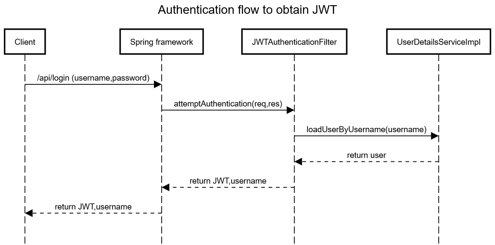
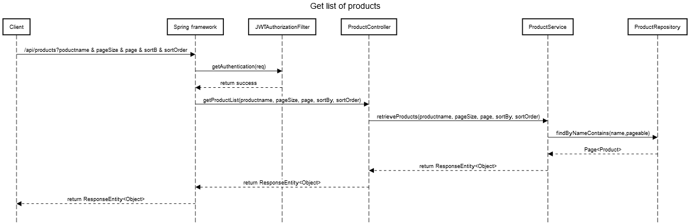

# Asellion-assignment

## Run application and tests
If you want to run the application from an IDE like eclipse/netbeans, run "com.asellion.AppMain.java".  Application uses POSTGRESQL db.

If you want to run the junit tests, run "ProductRestControllerIntegrationTest.java".  Tests use in-memory h2 db.

## Sequence daigram for user authenticatin flow

## Sequence daigram for get list of products flow

## Authenticate user
POST "http://localhost:8090/api/login" -H "Content-Type: application/json"

{
    "username": "user1",
    "password": "1234"
}

## Get list of products
GET "http://localhost:8090/api/products?pageSize=5&page=2&sortBy=id&sortOrder=asc" -H "Content-Type: application/json" -H "authorization: Bearer xxxx" -H "username: user1"

## Get one product from list
GET "http://localhost:8090/api/products/1" -H "Content-Type: application/json" -H "authorization: Bearer xxxx" -H "username: user1"

## Create a product
"POST" http://localhost:8090/api/products -H "Content-Type: application/json" -H "authorization: Bearer xxxx" -H "username: user1"

REQUEST:

{
    "name": "Product 8",
    "currentPrice": 20
}

## Update a product
"PUT" http://localhost:8090/api/products/5 -H "Content-Type: application/json" -H "authorization: Bearer xxxx" -H "username: user1"

REQUEST:

{
    "name": "Product 5",
    "currentPrice": 100.334
}

